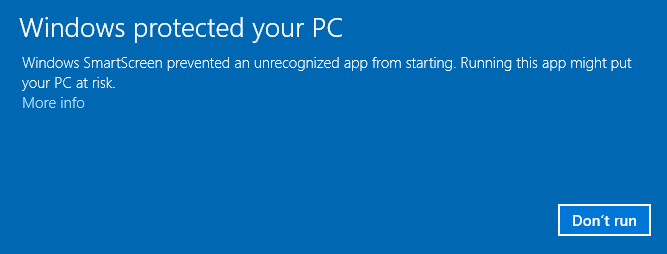
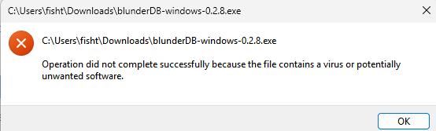
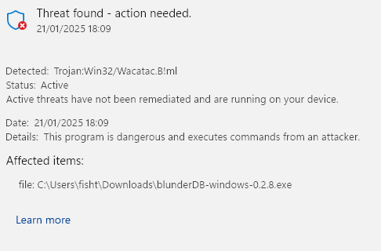
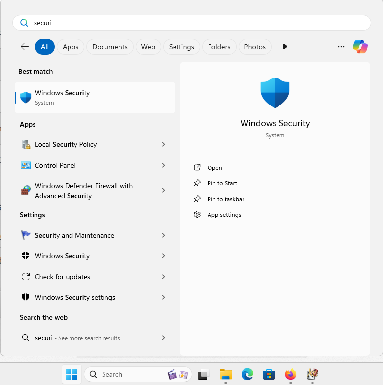
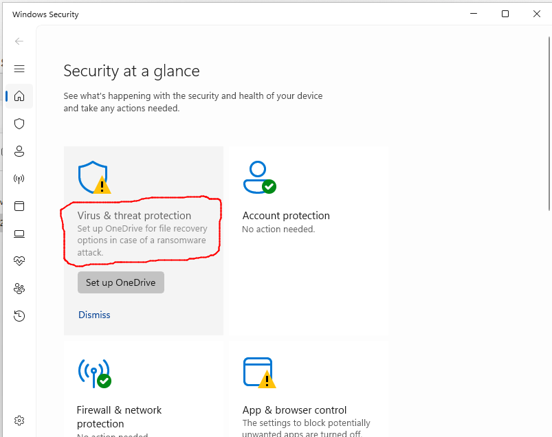
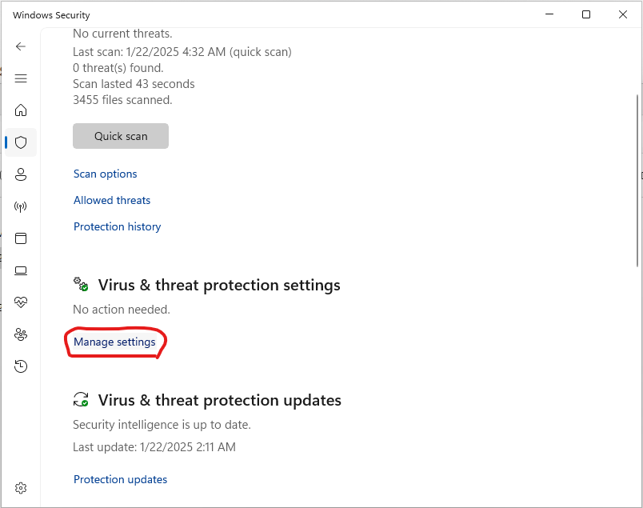
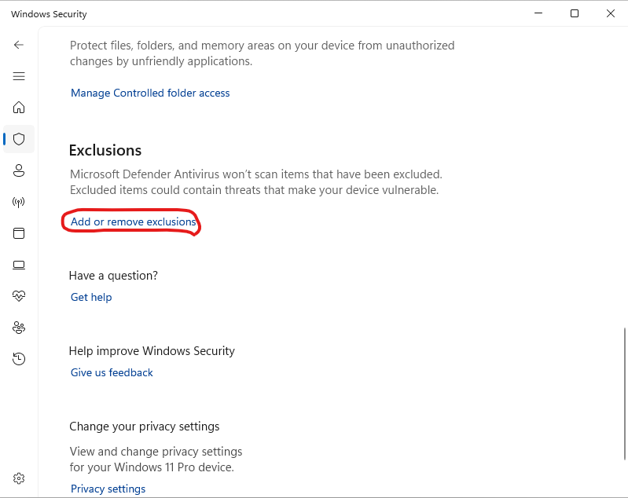
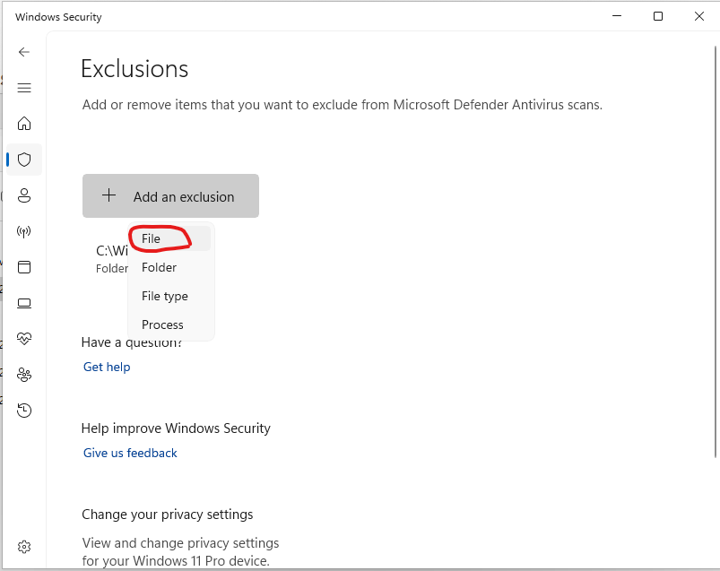
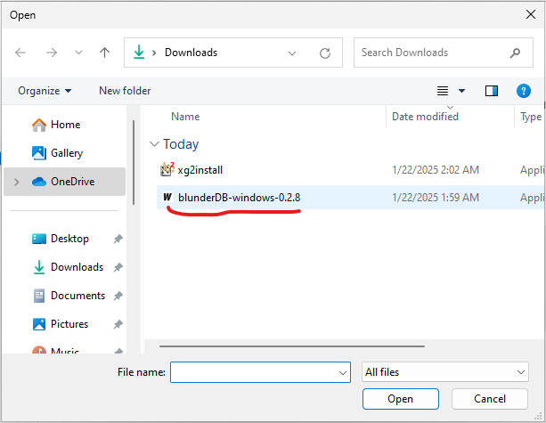
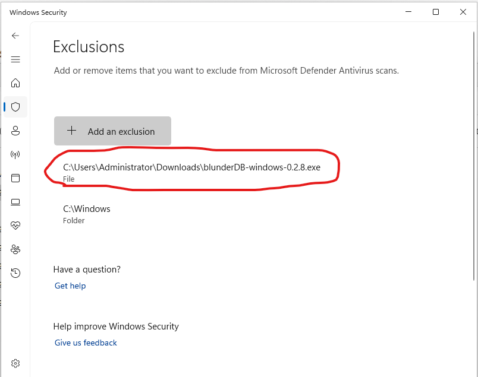

.. _annexe_windows_malware:

Annexe Windows : Détection abusive de blunderDB comme logiciel malveillant
==========================================================================

.. note:: Ce qui suit concerne les systèmes d'exploitation Windows 10 et 11.

Windows requiert aujourd'hui de la part de sociétés d'édition logicielle ou
d'éditeurs logiciel indépendants de certifier numériquement leurs applications
voire de distribuer via le Windows Store. Il est alors préconisé de faire appel
à des sociétés extérieures pour obtenir un certificat numérique au prix de
plusieurs centaines d'euros (voir par exemple
https://learn.microsoft.com/en-us/archive/blogs/ie_fr/certificats-de-signature-de-code-ev-extended-validation-et-microsoft-smartscreen
).

Partageant blunderDB gratuitement, je ne souhaite pas m'orienter vers ces
possibilités onéreuses. Par conséquent, il est fort probable que Windows vous
avertisse d'un potentiel danger, voire bloque complètement l'exécution de
blunderDB. Les sections suivantes expliquent les opérations à réaliser pour
passer outre les réticences de Windows.

Avertissement Windows SmartScreen
---------------------------------

Après téléchargement de blunderDB, lors de son exécution, il est possible que
Windows affiche un avertissement du type

Si vous souhaitez autoriser un exécutable spécifique bloqué par SmartScreen :

1. **Essayer d’exécuter l'exécutable** :

   - Lorsque vous essayez de lancer l'exécutable, SmartScreen peut le bloquer
     et afficher un avertissement.

2. **Cliquer sur "Informations supplémentaires"** :

   - Dans la fenêtre d'avertissement de SmartScreen, cliquez sur **Informations
     supplémentaires**.

3. **Sélectionner "Exécuter quand même"** :

   - Si vous faites confiance à l'exécutable, cliquez sur **Exécuter quand
     même** pour contourner l'avertissement SmartScreen pour cette instance.

Blocage Windows Defender
------------------------

Pour certains paramétrages sécurité de Windows, il arrive que malgré le
déblocage de SmartScreen (voir section plus précédente), Windows Defender
puisse empêcher l'exécution de blunderDB avec des messages du type 

ou encore

voire le placer en quarantaine.

Windows Defender est connu pour déclencher des faux positifs. Ce problème est
explicitement mentionné dans la FAQ du site officiel de Golang (
https://go.dev/doc/faq#virus ) ou dans des tickets Github de certains projets
programmés en Go ( https://github.com/golang/vscode-go/issues/3182 ).

Si vous souhaitez empêcher la Sécurité Windows d’analyser blunderDB :

1. **Ouvrir la Sécurité Windows** :

   - Allez dans **Démarrer** et tapez **Sécurité Windows**.

2. **Aller à "Protection contre les virus et menaces"** :

   - Cliquez sur **Protection contre les virus et menaces**.

3. **Gérer les paramètres** :

   - Faites défiler vers le bas et cliquez sur **Gérer les paramètres** sous Paramètres de protection contre les virus et menaces.

4. **Ajouter ou supprimer des exclusions** :

   - Faites défiler jusqu’à la section **Exclusions** et cliquez sur **Ajouter ou supprimer des exclusions**.

5. **Ajouter une exclusion** :

   - Cliquez sur **Ajouter une exclusion** et sélectionnez **Fichier**. Naviguez ensuite jusqu’à
     l’exécutable que vous souhaitez exclure et sélectionnez-le.

